# Object-Oriented Programming (OOP) in C++

## 📌 Coding Paradigms

1. **Procedural Programming**  
   - Code is written line-by-line in a sequential manner.

2. **Functional Programming**  
   - Code is written as a series of functions (e.g., STL functions in C++).
    
3. **Object-Oriented Programming (OOP)**  
   - Code is structured as a collection of **objects** that interact with each other during runtime.

---

## 🔷 OOP Entitiessssss

- **Classes**  
- **Objects** → An object is an instance of a class, created using the class constructor.

### Example:

```cpp
class File {
public:
    File() { /* Default constructor */ }

    File(string path) { /* Parameterized constructor */ }

    ~File() { /* Destructor: called when object is destroyed */ }

private:
    // private members
};
```

---

## 🔁 Object Lifecycle

- **Initialization** → controlled by the **constructor**
- **Running State** → the object is in use
- **De-initialization** → controlled by the **destructor**

---

## 🔐 Access Modifiers

| Modifier   | Description                                                |
|------------|------------------------------------------------------------|
| `public`   | Accessible from outside the class                          |
| `private`  | Accessible only from within the same class                 |
| `protected`| Accessible from the class and any class that inherits it  |

```cpp
// Example:
class File {
public:
    void read();
private:
    string path;
protected:
    void open();
};
```

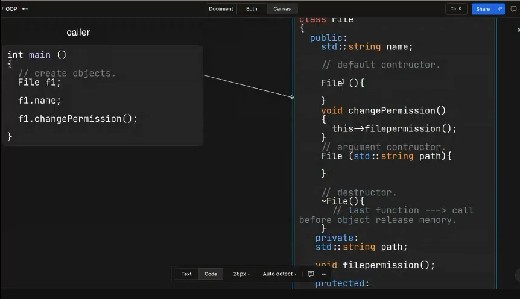

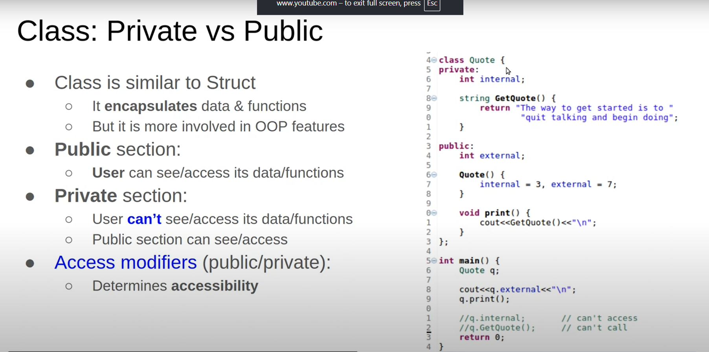

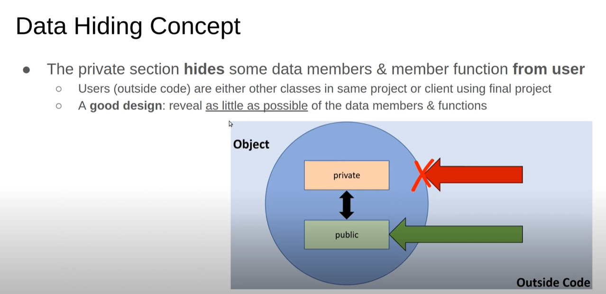

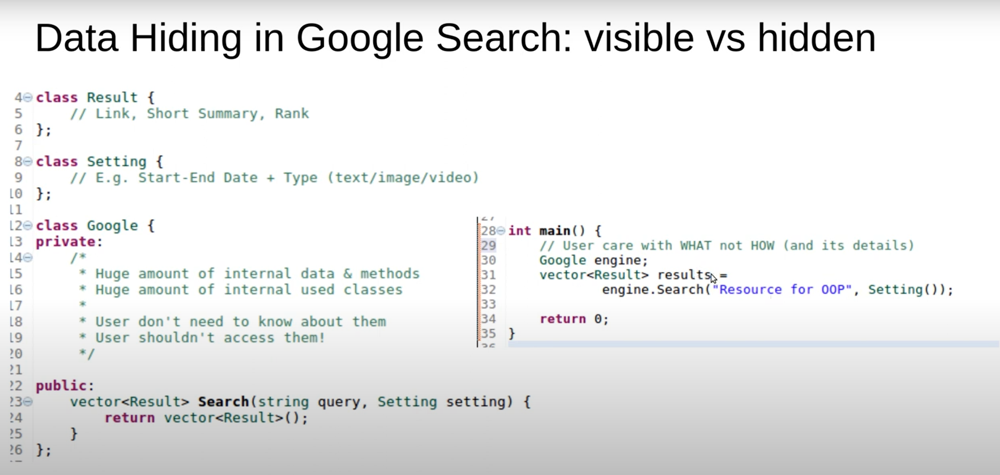

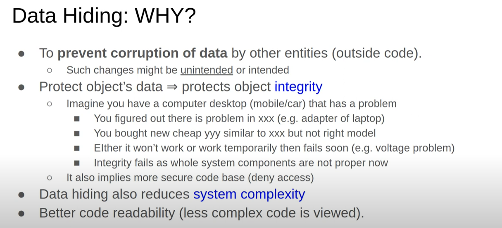

## what is the difference between encapsulation and data hiding 

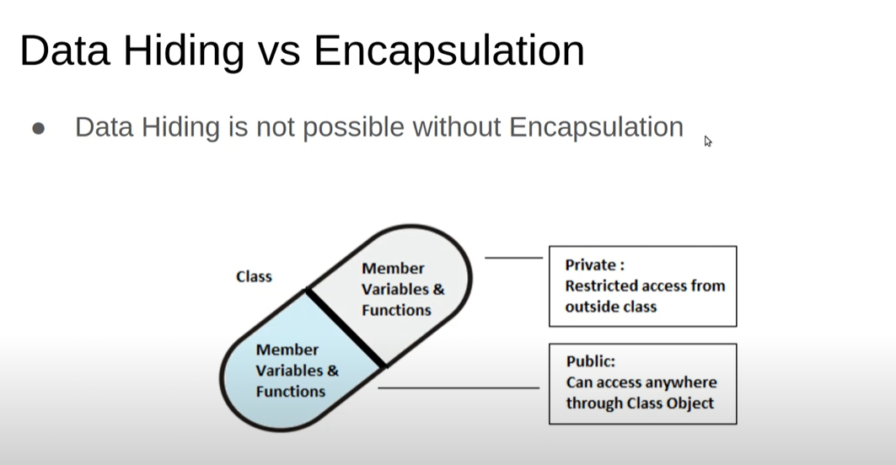
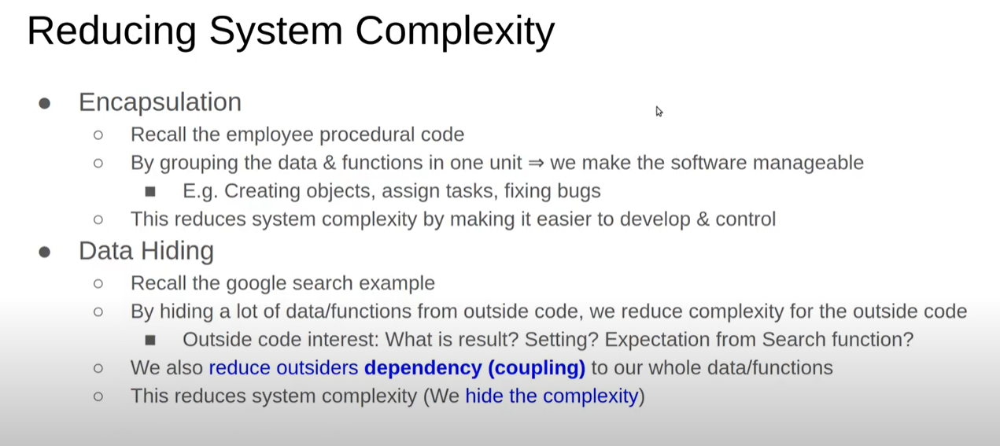

data hiding-->using private and public 

abstraction--> using separation between what , how and private,public
---
## Setters and Getters
when the user need to access private data they use te setters and the getters
Don't add setters and getters for private data

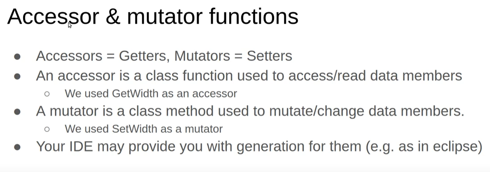

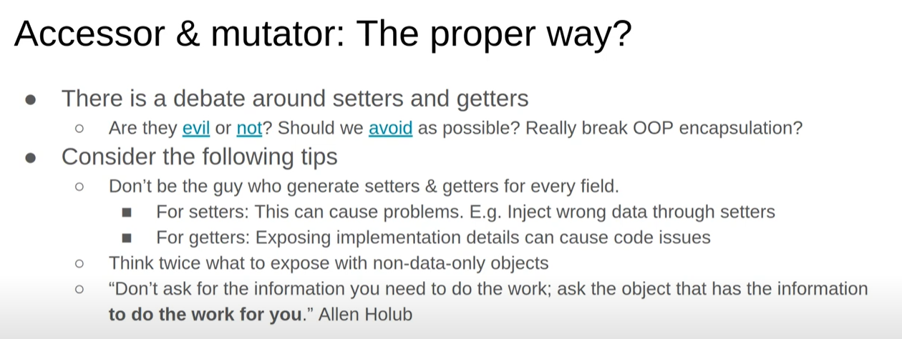
---
## 🏗️ Designing a Class from Requirements

1. Start from the **requirements**
2. Identify:
   - **Nouns** → Potential classes or data members
   - **Verbs** → Methods or behaviors
3. Apply the **A-B-C-D-F-G** method (a structured methodology for design)

### Example Requirements:
- `open()`
- `read()`
- `write()`
- File should contain a `path`

→ Leads to the following design:

```cpp
class File {
public:
    void read(string path);
    void write();

private:
    void open();
    string path;
};
```

---
### Complex class example

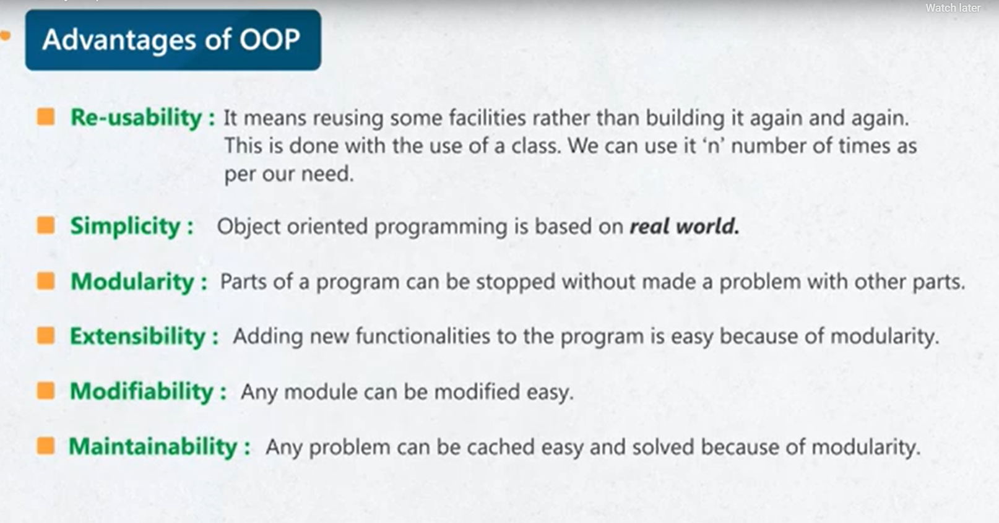


## 🌟 Main Features of OOP

### ✅ 1. Encapsulation

- Bundles related data (variables) and methods that operate on the data into a single unit (class).
- Helps in data hiding and modularity.

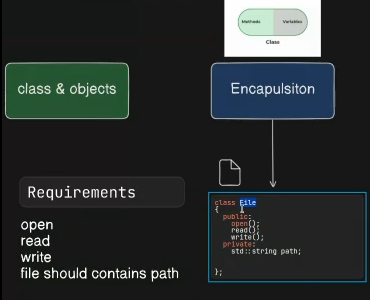

struct also can apply encapsulation concept

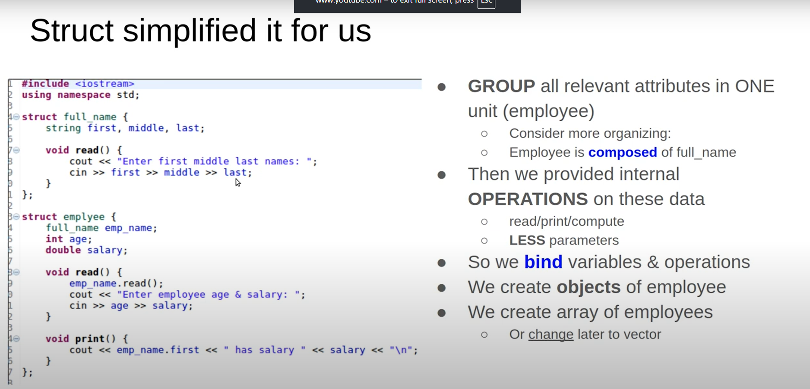

---

### 🎭 2. Abstraction

- Hides internal implementation and exposes only necessary parts.
- Achieved using access modifiers.

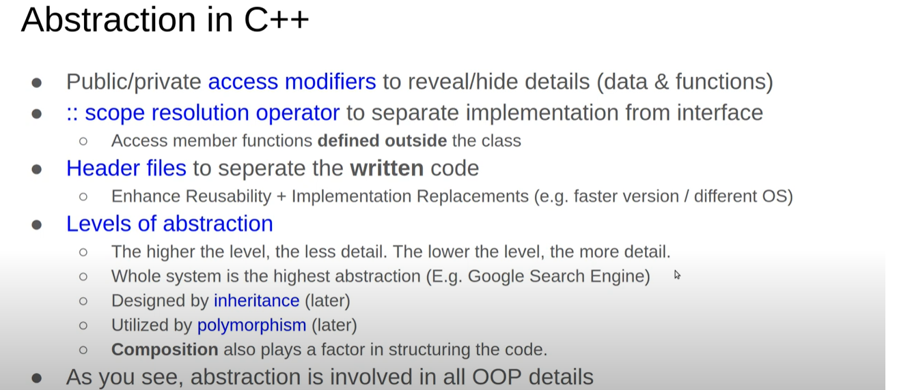

```cpp
class File {
public:
    void read(string path);
    void write();

private:
    void open();        // Internal helper
    string path;        // Hidden from external access
};
```

> Only `read()` and `write()` are accessible from the main program. `open()` and `path` are internal.

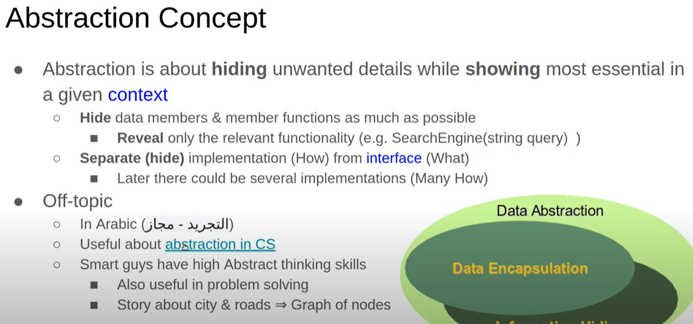

separating what from how 

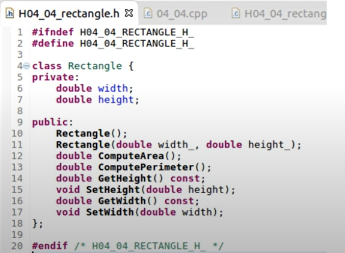
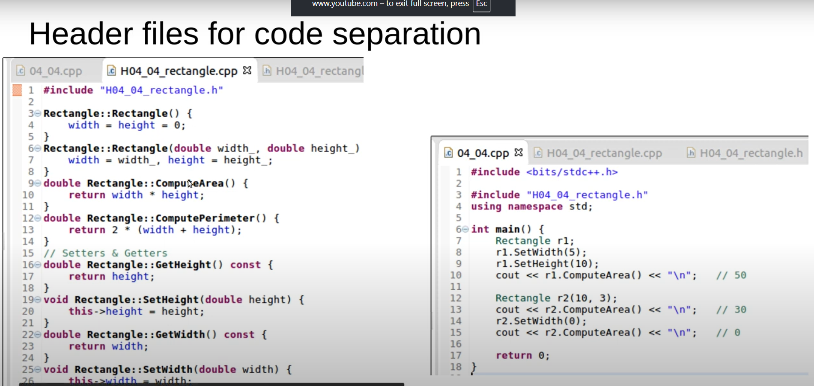
---

### 🧬 3. Inheritance

- A mechanism for a class (child/derived) to acquire properties and methods of another class (base).

```cpp
class File {
public:
    void read(string path);
    void write();

private:
    void open();
    string path;
};

class WordFile : public File {
    // Inherits public and protected members from File
};
```

> `WordFile` inherits functionality from `File`.

---

### 🌀 4. Polymorphism (متعدد الأوجه)

- Allows functions to behave differently based on the object that calls them.
- Achieved using **virtual functions** and **overriding**.

```cpp
class File {
public:
    virtual void read(string path) {
        cout << "text file";
    }

    void write();

private:
    void open();
    string path;
};

class WordFile : public File {
public:
    void read(string path) override {
        cout << "word file";
    }
};

void print_content(File* f) {
    f->read();
}

int main() {
    File f1;
    WordFile f2;

    print_content(&f1);  // Output: text file
    print_content(&f2);  // Output: word file
}
```

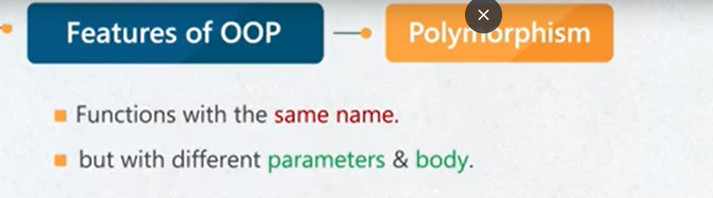

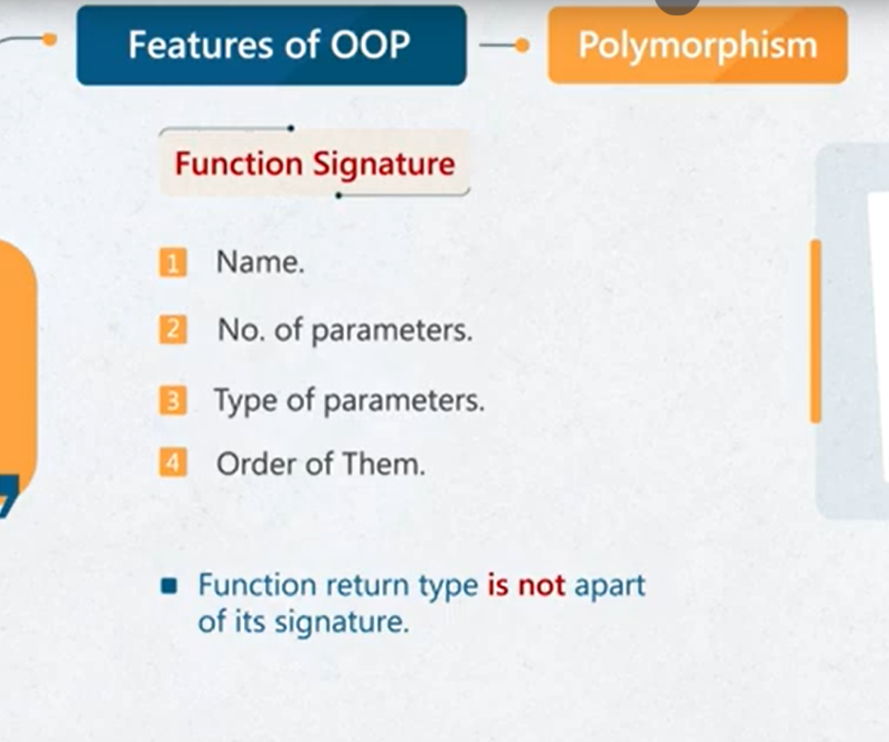
---

## 🧾 Summary

| Concept        | Description                                                            |
|----------------|------------------------------------------------------------------------|
| **Class**      | Blueprint for creating objects                                         |
| **Object**     | Instance of a class                                                    |
| **Encapsulation** | Bundles related data and methods                                    |
| **Abstraction**   | Hides unnecessary details from the user                             |
| **Inheritance**   | Enables reuse and extension of existing code                        |
| **Polymorphism**  | Enables different behaviors with the same interface or base pointer |


---

## 📎 Visuals

- 
- 

## helpfull slides made by eng:Mostafa Saad

https://www.youtube.com/redirect?event=video_description&redir_token=QUFFLUhqbVdWZnpVWU05UTJQeWxUcmM4VDJiQXJfMEJhd3xBQ3Jtc0ttQWk2Q1RQYk5qWmtkRjJvb0hVUmtiTTg4X25DLUZOOXE5V1hpcHFQUzkyVFpHTF9hRW11ckRESm0teVh6M3M0NXVWSVp5dzV6RzVZaGF5UmF6VkcyMXdVX2F1ZWxybnVrVXNjZmV6TUJqMFBkck1lSQ&q=https%3A%2F%2Fdrive.google.com%2Fdrive%2Ffolders%2F1NtU4CkYZlbRiswKV2YXwk3irV4aQ5RmU%3Fusp%3Dsharing&v=cxsYqflY0fM
